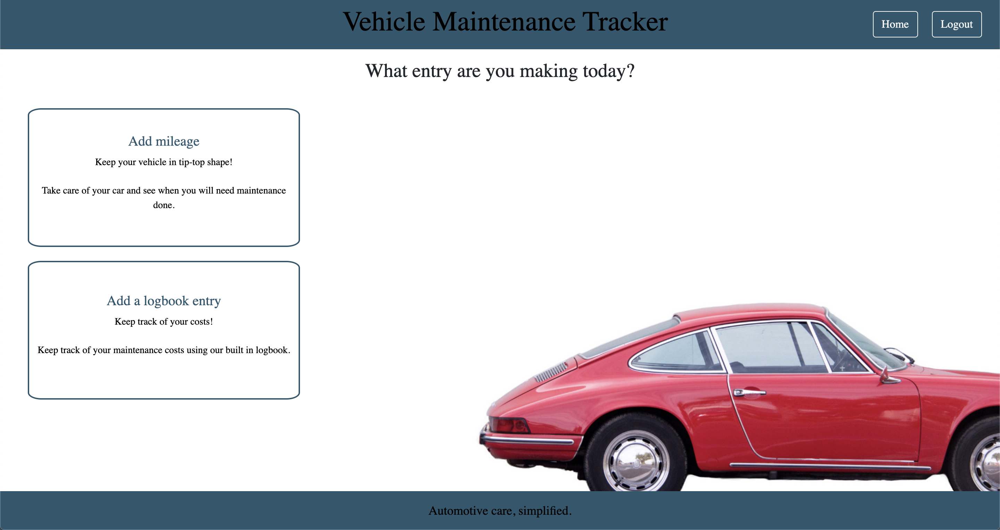

# Vehicle Maintenance Tracker
Deployed app: [Automotive Tracker](https://automotive-service.herokuapp.com/)

## :bulb: DESCRIPTION
User can track time and mileage on their vehicle and then be given a time frame for their next maintenance check. 
Display's a responsive front-end comprised of SASS and Handlebars.js, and a back end built with Node and MySQL2

## :hammer: TOOLS
* [Express.js](https://expressjs.com/)
* [Node.js](https://nodejs.org/en/)
* [MySQL2](https://www.npmjs.com/package/mysql2)
* [Insomnia](https://insomnia.rest/)
* [Heroku](https://www.heroku.com/home)
* [Handlebars.js](https://handlebarsjs.com/)
* [Dotenv](https://www.npmjs.com/package/dotenv)
* [BCrypt](https://www.npmjs.com/package/bcrypt)
* [Connect Session Sequelize](https://www.npmjs.com/package/connect-session-sequelize)
* [Express Session](https://www.npmjs.com/package/express-session)
* [node-sass](https://www.npmjs.com/package/node-sass)
